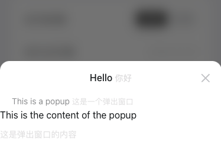

# 前提

目前用到的必要模块和版本大致如下：
```bash
  "react": "^18.2.0"
  "react-dom": "^18.2.0"
  "react-vant": "2.0.0-alpha.38"
  "rollup-plugin-react-scoped-css": "^0.8.2"
  "sass": "^1.63.6"
  "typescript": "^5.0.2"
```
## 关于ConfirmationDialog组件

`ConfirmationDialog` 是一个基于 react-vant 库的 `Dialog` 组件扩展的自定义确认对话框组件。它继承了 `Dialog` 组件的所有功能，并添加了一些自定义的属性和行为，使其更适合在特定的上下文中使用。

这个组件的主要属性和方法包括：

- `titleTxt`、`subTitleTxt` 和 `confirmTxt`：分别是对话框的标题文本，副标题文本和确认按钮的文本，都是可选的。
- `visible`：一个布尔值，决定对话框是否可见。
- `onConfirm`：一个函数，当点击确认按钮时会被调用。

这个组件的样式使用了 SCSS，它定义了对话框的布局和颜色等样式。

组件详情见：[ConfirmationDialog.tsx](./ConfirmationDialog.tsx)文件

###  使用ConfirmationDialog组件

```tsx
import ConfirmationDialog from 'xx/ConfirmationDialog'//引入定义好的组件
const UseConfirmationDialog=()=>{
 const [visible, setVisible] = useState(false)

  const onClick = () => {
    setVisible(true)
  }
  const handleConfirm = () => {
    setVisible(false)
  }
  return (
    <>
      <div onClick={onClick}> 点击显示弹框</div>
      <ConfirmationDialog
        visible={visible}
        onConfirm={handleConfirm}
        titleTxt={'图片上传成功'}
      />
    </>
  )
}
 
export default UseConfirmationDialog
</script>
```


## 关于usePopup Hook

`usePopup` 是一个自定义的 React Hook，用于创建和管理一个弹窗。它基于 react-vant 库的 `Popup` 组件。

这个 Hook 的主要属性和方法包括：

- `visible`：一个布尔值，决定弹窗是否可见。
- `onOpen` 和 `onClose`：两个函数，用于打开和关闭弹窗。
- `PopupComponent`：一个函数组件，用于渲染弹窗。它接受一个对象作为参数，这个对象可以包含 `Popup` 组件的所有属性，以及额外的 `height`和 `description` 属性。(`description`仅是为了在使用时写属性名更易于理解，react-vant 库的该属性取名是`descrition`，使用时可能不太会注意)

Hook 详情见：[usePopup.tsx](./hook/usePopup.tsx) 文件

### 使用usePopup Hook

```tsx
import React from 'react'
import usePopup from 'xxx/usePopup'//引入定义好的hook

function ExampleComponent() {
  const { PopupComponent, onOpen, onClose } = usePopup()

  const handleClick = () => {
    onOpen({
      title: 'Hello',
      description: 'This is a popup',
      closeable: true,
      height: '200px',
      children: <div>This is the content of the popup</div>
    })
  }

  return (
    <div>
      <button onClick={handleClick}>Open Popup</button>
       <button onClick={onClose}>Close Popup</button>
      <PopupComponent />
    </div>
  )
}

export default ExampleComponent
```
