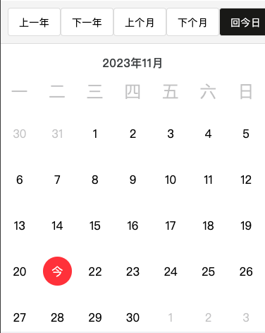
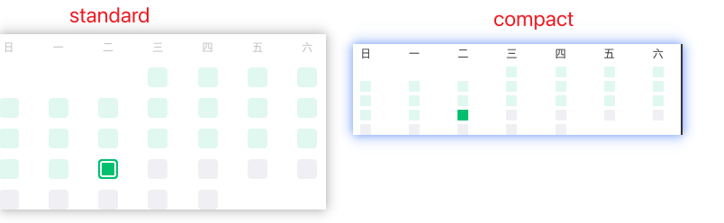

# 前提

封装的组件中，项目是用了[uni-app](https://uniapp.dcloud.net.cn/)框架，但封装的组件中目前仅用了它的生命周期函数[onLoad](https://uniapp.dcloud.net.cn/tutorial/page.html#onload)，可不将其算为封装的`uni-app`的组件，按需自行更改和扩展。

其余用到的必要模块和版本大致如下：
```bash
"vue": "^3.2.33"
"dayjs": "^1.11.5"
"sass": "^1.49.9"
"typescript": "^4.6.3"
```
## 关于CustomCalendar.vue组件

`CustomCalendar` 是一个自定义的日历组件，它使用 Vue 3 和 dayjs 库来创建。这个组件的主要功能包括：

1. 默认显示当前的年份和月份。
2. 显示一周的每一天，可以选择一周的第一天是周一还是周日。
3. 显示一个月的每一天，包括上个月和下个月的一些天，这些天用于填充日历的空白部分。
4. 当用户点击一天时，发出一个 `select` 事件，事件的参数是一个包含这一天的信息的对象。
5. 提供了一些按钮，用户可以点击这些按钮来切换到上一年、下一年、上个月、下个月或者回到今天。

这个组件的主要数据和方法包括：

- `currentDate`：当前显示的日期。
- `currentYear` 和 `currentMonth`：当前显示的年份和月份。
- `calendarDays`：一个月的每一天，包括上个月和下个月的一些天。
- `weekDays`：一周的每一天。
- `getPrevYear`、`getNextYear`、`getPrevMonth`、`getNextMonth` 和 `backToToday`：这些方法用于切换到上一年、下一年、上个月、下个月或者回到今天。
- `generateDays`：这个方法用于生成一系列的日期对象。
- `renderCalendar`：这个方法用于渲染日历。

这个组件的样式使用了 SCSS，它定义了日历的布局和颜色等样式。

组件详情见：[CustomCalendar.vue](./CustomCalendar.vue)文件

###  使用CustomCalendar.vue组件

```vue
<template>
    <CustomCalendar :initialDate="initialDate" @select="handleSelect" />
</template>

<script setup lang="ts">
import { ref } from "vue";
import CustomCalendar from "./CustomCalendar.vue"; //引入定义好的日历组件
const initialDate = ref(new Date().getTime());

function handleSelect(selectedDay) {
  console.log("Selected day:", selectedDay);
}
</script>
```



## 关于HeatmapCalendar.vue组件

 是一个热力图组件 `HeatmapCalendar` 是一个可视化组件，它以热力图的形式显示了日期和对应的数据。在这个组件中，每一天都是一个单元格，单元格的颜色表示了那一天的数据。颜色的深浅通常表示数据的大小，例如，颜色越深表示数据越大。

这个组件通常用于显示时间序列数据，例如用户活动、温度变化等。用户可以一眼看到数据在不同日期的分布和变化，这对于发现数据的模式和趋势非常有帮助。

`HeatmapCalendar`组件中， 它接收一个包含日期和对应数据的数组作为输入，然后渲染出一个热力图。你可以通过修改这个数组来更新热力图。

它使用 Vue 3 和 dayjs 库来创建。这个组件的主要功能包括：

1. 显示当前的年份和月份。
2. 显示一周的每一天，可以选择一周的第一天是周日还是周一。
3. 显示当前月份的每一天，每一天都有一个背景颜色，这个颜色可以通过 `markedDates` 属性来设置。
4. 当用户点击一天时，发出一个 `select` 事件，事件的参数是一个包含这一天的信息的对象。

这个组件的主要数据和方法包括：

- `initDate`：初始化显示的年月，年-月，默认显示当前年月。
- `markedDates`：需要特殊标记的日期。
- `calendarType`：控制总体显示样式，可以是 'standard' 或 'compact'。
- `weekDays`：一周的每一天。
- `calendarDays`：当前月份的每一天。
- `renderCalendar`：这个方法用于渲染日历。

这个组件的样式使用了 SCSS，它定义了日历的布局和颜色等样式。

组件详情见：[HeatmapCalendar.vue](./HeatmapCalendar.vue)文件

### 使用HeatmapCalendar.vue组件

```vue
<template>
 <HeatmapCalendar calendarType="compact" :markedDates="markedDates" />
</template>

<script setup lang="ts">
import { ref } from "vue";
import HeatmapCalendar from "./HeatmapCalendar.vue"; //引入定义好的热力图组件
import {TMarkedDates} from "./types" //引入定义好的类型
import dayjs from 'dayjs' //引入dayjs插件

interface TemperatureDataItem {
  date: string
  temperature: number
}

const markedDates = ref<TMarkedDates>([])

onLoad(() => {
    getTemperatureHeatmapData()
})


const POSITIVE_TEMPERATURE_COLOR = '255, 136, 0' // 黄色
const NEGATIVE_TEMPERATURE_COLOR = '0, 126, 199' // 蓝色
const TODAY_ALPHA = 1
const POSITIVE_TEMPERATURE_ALPHA = 0.5
const NEGATIVE_TEMPERATURE_ALPHA = 0.3

function getTemperatureHeatmapData() {
  const temperatureData: TemperatureDataItem[] = [
    // 更多日期...
    { date: '2023-11-17', temperature: -5 },
    { date: '2023-11-18', temperature: 10 },
    { date: '2023-11-19', temperature: 15 },
    { date: '2023-11-20', temperature: 7 },
    { date: '2023-11-21', temperature: -3 },
    { date: '2023-11-22', temperature: 20 } // 今日
  ] // 后台返回的数据格式（返回当前月份数据），当前是11月
  const filteredData = temperatureData.filter(({ date }) => dayjs(date) <= todayDate)
  const temperatureHeatmapData = filteredData.map(({ date, temperature }) => ({
    date,
    bgColor: getTemperatureHeatmapBgColor({ date, temperature })
  }))
  markedDates.value = temperatureHeatmapData
}

function getTemperatureHeatmapBgColor({ date, temperature }: TemperatureDataItem) {
  const isToday = dayjs(date).isSame(todayDate, 'day')
  const alpha = isToday ? TODAY_ALPHA : temperature >= 0 ? POSITIVE_TEMPERATURE_ALPHA : NEGATIVE_TEMPERATURE_ALPHA
  const color = temperature >= 0 ? POSITIVE_TEMPERATURE_COLOR : NEGATIVE_TEMPERATURE_COLOR
  return `rgba(${color},${alpha})`
}
</script>
```


